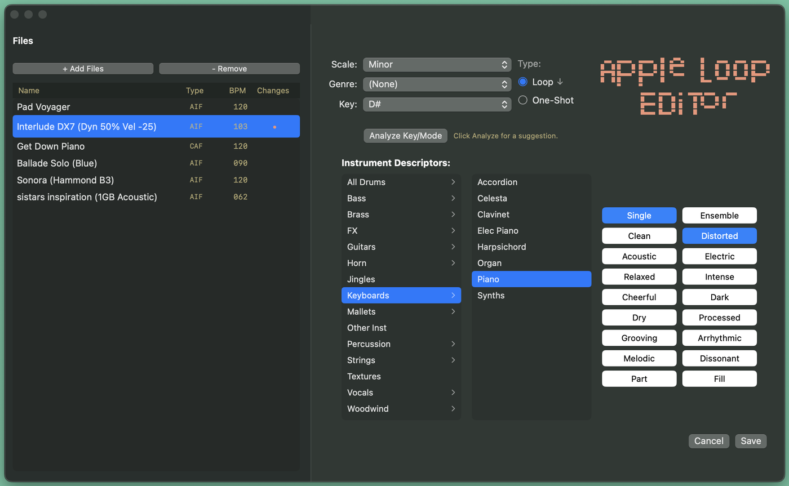

# Apple Loop Editor

Apple Loop metadata editor — this app edits any **Apple Loop-specific metadata** (**Scale**, **Genre**, **Key**, **Type** and **Instrument Descriptors**) already embedded in existing Apple Loops, without going through Logic Pro or GarageBand. It replaces Apple's discontinued Apple Loops Utility, which is no longer compatible with modern ARM64 architectures.



## Features

- Edit the **Scale**, **Genre**, **Key**, **Type** (Loop / One-Shot) tags
- Full **Instrument Descriptors** editing (category, subcategory, and attributes such as Single/Ensemble, Clean/Distorted, Acoustic/Electric, etc.)
- **Suggestive Key/Scale analysis**: suggests the 3 most likely keys with their probability, from the loop's audio and, for software-instrument loops, its embedded MIDI performance, using small models trained on Apple's own tagged loops (right key ~61% of the time on loops they never saw, ~70% when the loop has MIDI; right key in the top 3 ~86%). Click a suggestion to apply it. Purely indicative, never overwrites existing tags until you save
- **Batch** editing (multi-file selection)
- Built-in audio playback/preview of the selected loop, using spacebar
- Drag and drop of files or entire folders
- Automatic container format detection (classic AIFF or CAF)

## Download

No Xcode needed: download the latest compiled build directly from the **[Releases](https://github.com/Creme74/AppleLoopEditor/releases/latest)** page, unzip it, and launch `AppleLoopEditor.app`.

> **First launch:** since the app isn't signed with a paid Apple Developer account, macOS (Gatekeeper) will show a warning the first time you open it. This is only needed once.
> - **macOS Sonoma (14) and earlier:** right-click (or Ctrl-click) `AppleLoopEditor.app` → **Open**, then confirm.
> - **macOS Sequoia (15) and later:** the right-click shortcut no longer works. Double-click the app once (macOS will refuse to open it), then go to **System Settings → Privacy & Security**, scroll down to the message about `AppleLoopEditor` being blocked, click **Open Anyway**, then confirm with your password.

## Build from source

- macOS 13 or later (tested on macOS 14)
- Xcode 16 or later

```bash
git clone https://github.com/Creme74/AppleLoopEditor.git
cd AppleLoopEditor
open AppleLoopEditor.xcodeproj
```

Then Run (⌘R) in Xcode.

## License

This project is distributed under the **GPL-3.0-or-later** license — see [LICENSE](LICENSE).

## Author

Made by **Nicolas Scaravilli** (Kid Creme)

- [Bandcamp](https://kidcreme.bandcamp.com/)
- [Spotify](https://open.spotify.com/artist/21LRoheW1z49N5d52wlQ5X)
